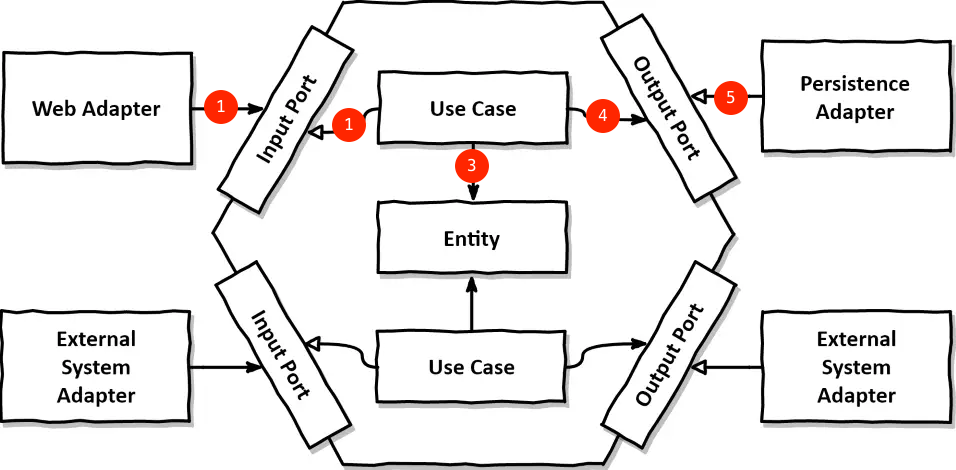

# Hexagonal Architecture Example

육각형 구조에 대한 블로그 포스트를 위한 예제 프로젝트

## 개요

화살표의 방향은 의존의 방향; Domain에서 밖으로 나가는 화살표는 없다!!!



- (1) Web Adapter는 Input Port를 사용한다
- (2) Use Case는 Input Port를 구현한다
- (3) Use Case는 Domain을 사용한다
- (4) Use Case는 Output Port를 사용한다
- (5) Persistence Adapter는 Output Port를 구현한다

## 구현

```shell
$ tree src/main/java/com/example/hexagonal
src/main/java/com/example/hexagonal
├── HexagonalExampleApplication.java
├── adapter
│   ├── in
│   │   └── ProductController.java
│   └── out
│       └── HypotheticalMessageSender.java
├── domain
│   └── Product.java
├── port
│   ├── in
│   │   └── ProductPort.java
│   └── out
│       ├── MessagePort.java
│       └── ProductJpaRepository.java
└── usecase
    └──  ProductService.java
```