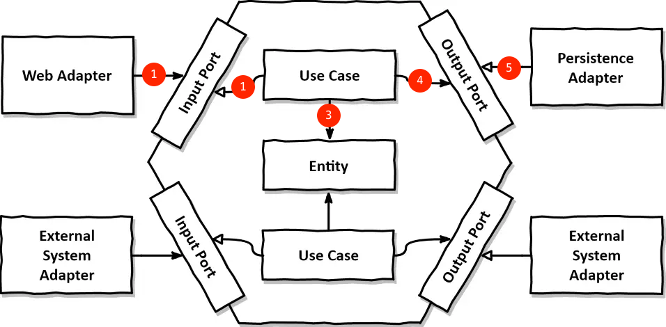

# Hexagonal Architecture Example

육각형 구조에 대한 블로그 포스트를 위한 예제 프로젝트

## 개요

- 화살표의 방향은 의존의 방향
- 헥사고날 아키텍처 **패턴**: [토비님의 포스트](https://www.facebook.com/tobyilee/posts/10226281856887395)
- 애플리케이션과 외부 세상을 분리한다: [토비님과의 대화](https://www.facebook.com/tobyilee/posts/10226233229911751?comment_id=1336598547048666&reply_comment_id=266120746391633)
- [How to Write Good Use Case Names](https://tynerblain.com/blog/2007/01/22/how-to-write-good-use-case-names/)



UML 읽는 법: `->` has-a; `-|>` is-a

- (1) Web Adapter는 Input Port를 사용한다
- (2) Use Case는 Input Port를 구현한다
- (3) Use Case는 Domain을 사용한다
- (4) Use Case는 Output Port를 사용한다
- (5) Persistence Adapter는 Output Port를 구현한다

### 생각해 볼꺼리

- OO & FP에 대한 오현석님의 생각: [범균님의 포스트에 대한 댓글](https://www.facebook.com/beomkyun.choi/posts/6953683524663441?comment_id=1721023311652911&reply_comment_id=845910123641906)
- [인스타그램이 14백만명을 확보할 때까지 개발자 3명, 페이스북에 인수될 때 개발자 14명, 어떻게 가능했을까? 답은 3가지 원칙: Keep things very simple; Don't re-invent the wheel; Use proven, solid technologies when possible](https://news.hada.io/topic?id=10916)

주)
- 토비 이일민님: [fb](https://www.facebook.com/tobyilee), [토비의 스프링](https://www.yes24.com/24/Category/Series/001?SeriesNumber=102134) 저자 
- 최범균님: [fb](https://www.facebook.com/beomkyun.choi), [도메인 주도 개발 시작하기 외](https://www.yes24.com/24/AuthorFile/Author/291285)
- 오현석님: [fb](https://www.facebook.com/oh.hyunsok), [Kotlin in Action 외](https://www.yes24.com/24/AuthorFile/Author/192002)

## 구현

- 주의: kotlin에서는 `in`, `out` 예약어임에 유의할 것

```shell
$ tree java/src/main/java/com/example/hexagonal
├── HexagonalExampleApplication.java
├── adapter
│   ├── inbound
│   │   ├── rest
│   │   │   └── ProductController.java
│   │   ├── grpc
│   │   │   └── ProductServiceImpl.java       # 미구현
│   │   ├── kafka
│   │   │   └── InventoryMessageConsumer.java # 미구현
│   │   └── scheduler
│   │       └── ProductScheduledTask.java     # 미구현
│   └── outbound
│       ├── kafka
│       │   └── ProductMessageProducer.java   # 미구현
│       ├── fcm
│       │   └── ProductMessagePublisher.java  # 미구현
│       └── jpa
│           └── ProductJpaRepository.java     # 미구현
└── application
    ├── domain
    │   └── Product.java                      # Pojo or JPA @Entity? 토비님과의 대화 링크 참고
    ├── port
    │   ├── inbound
    │   │   └── ProductPort.java
    │   └── outbound
    │       ├── MessagePort.java
    │       └── ProductRepository.java       # Pojo or JPA Repository? 토비님과의 대화 링크 참고
    └── usecase
        └── ProductUsecase.java
```
