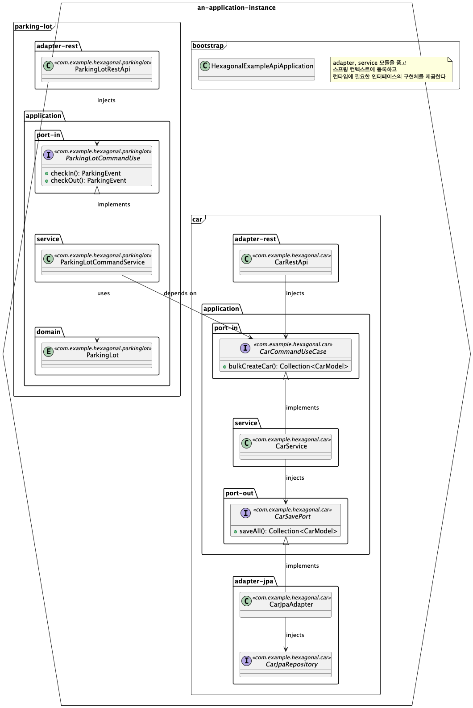

# Hexagonal Parking System (교육용 예제)

이 프로젝트는 **헥사고날 아키텍처(Hexagonal Architecture)** 를 적용하여, `Car`(차량), `ParkingLot`(주차장) 두 도메인을 중심으로 구성된 주차장 예제 시스템이다.

헥사고날 아키텍처의 핵심은:

- 도메인 모델의 **순수성 유지**
- 내부와 외부를 **포트(Port)** 와 **어댑터(Adapter)** 로 명확히 분리
- 의존성의 방향이 항상 **도메인 중심**으로 향하도록 유지

---

## 🗂️ 프로젝트 구성

```bash
.
├── application-api    # 애플리케이션 부트스트랩
├── car                # 차량 도메인
│   ├── adapter-jpa
│   ├── adapter-rest   # REST API 어댑터
│   └── application    # JPA 어댑터
│       ├── domain     # Car 도메인 모델
│       ├── exception
│       ├── port-in    # 인바운드 포트 (유스케이스)
│       ├── port-out   # 아웃바운드 포트 (리포지토리, 외부 api 등)
│       └── service    # 유스케이스 구현
└── parking-lot        # 주차장 도메인
    ├── adapter-rest
    └── application
        ├── domain
        ├── port-in
        └── service
```



---

## 🚀 실행 방법

lint
```bash
./gradlew ktlintForamt
```

test
```bash
./gradlew clean test
```

### application-api

run application-api
```bash
./gradlew :application-api:bootRun
# http://localhost:8080/swagger-ui/index.html Swagger UI로 api 테스트
```

docker image build & run application-api
```bash
./gradlew :application-api:jibDockerBuild
docker run -it --rm -p 8080:8080 application-api:0.0.1-SNAPSHOT
# http://localhost:8080/swagger-ui/index.html Swagger UI로 api 테스트
```

### application-cron

run application-cron
```bash
./gradlew :application-cron:bootRun
# ...  INFO 91210 --- [hexagonal-example-cron] [   scheduling-1] c.e.h.p.ParkingLotSettlementScheduler    : 정산을 시작합니다
# ...  INFO 91210 --- [hexagonal-example-cron] [   scheduling-1] c.e.h.p.ParkingLotSettlementScheduler    : 정산을 종료합니다
```

docker image build & run application-cron
```bash
./gradlew :application-cron:jibDockerBuild
docker run -it --rm application-cron:0.0.1-SNAPSHOT
# ...  INFO 1 --- [hexagonal-example-cron] [   scheduling-1] c.e.h.p.ParkingLotSettlementScheduler    : 정산을 시작합니다
# ...  INFO 1 --- [hexagonal-example-cron] [   scheduling-1] c.e.h.p.ParkingLotSettlementScheduler    : 정산을 종료합니다
```

---

## 참고 자료
- [Hexagonal Architecture](https://www.arhohuttunen.com/hexagonal-architecture-spring-boot/) - Arho Huttunen
- [레거시를 대물림하지 않는 아키텍처: flex의 5년간의 여정](https://flex.team/blog/2025/06/02/flexteam_legacy/) - flex
- [내가 경험한 DDD, Hexagonal](https://blog.appkr.dev/work-n-play/learn-n-think/ddd-hexagonal/) - Juwon Kim
